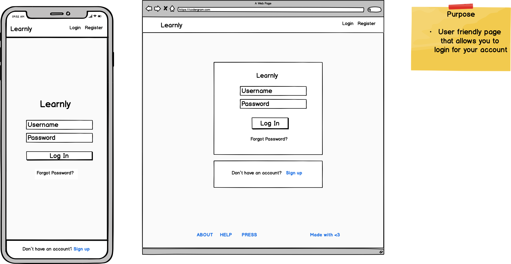

# Learnly

#### Trello board to get stuff done

Link: https://trello.com/b/YtKNctnC/learnly

## Overview

Learnly is an online social platform application that promotes the idea of learning in public. Learning in public is one of the best ways to learn. By teaching others what you know, you are able to apply the Feynman technique to your learning. The following are examples of learning in public:

* Write blogs and tutorials and cheatsheets.

* Speak at meetups and conferences.

* Ask and answer things on Stackoverflow or Reddit. 

* Make Youtube videos or Twitch streams.

* Start a newsletter.

* Drawing cartoons.

Learnly has been designed to foster sharing of learning content in a visually concise way.

Users sign up for an account and post photos of what they have learnt and their learning milestones. Taking inspiration from Instagram, it’s an application that enables people to catalogue their learnings and make their learnings social. 


## Instructions and Help

### System Requirements

In order to run this application, the user will preferably be running on a *nix based operation system (i.e. MacOS or Linux). However, Windows is supported due to the cross-platform nature of Python 3 but was not tested on.

### Python 3

The application requires Python 3 to be installed on your machine. To check if it is installed, you can enter the following command:

```
$ which python3
```
or

```
$ python3 --version
```

If you need to install Python 3, you can download the latest Python 3 version at [https://www.python.org/downloads/](https://www.python.org/downloads/ "https://www.python.org/downloads/").


### Clone the git repository on your computer.
```
$ git clone https://github.com/GabrielWongAu/learnly-app.git
```

You can also download the entire repository as a zip file and unpack it on your computer if you do not have git.

After cloning the repository, you need to change directory into the new learnly-app directory.
```
$ cd learnly-app
```

### Setting up a virtual environment 

It is recommended to create a virtual environment to contain the application's dependencies in the one folder. This can be done by running the following commands.

If you need to install Python's virtual environment module, run the following command:
```
$ pip install venv
```
Once venv has been installed, initalise the virtual environment by running the following command:  
```
$ python3 -m venv venv
```

To activate the virtual environment, run the following command:
```
$ source venv/bin/activate
```

Note: Once you have finished with the Learnly application, you can deactivate the virtual environment by running the following command:
```
$ deactivate
```
### Install Dependencies

Modules will need to be installed before running the application. They can be installed by running the following command in your terminal:

```
$ pip install -r requirements.txt
```

### Run the program

Run the program by running the following command

```
$ python src/main.py
```

## CI/CD

I have implemented a CI/CD pipeline using Github Actions. It takes advantage of Python3.8, Pip3 and runs on the latest stable version of Ubuntu. The pipeline is started on a push to master.

Once it has pulled from master it installs the dependencies from requirements.txt. It runs the tests in the tests directory.

## Wireframes

### Landing page

This will be the page that the user lands on when they reach the website. It's purpose is to showcase the application and let people login to continue using it. There is a link below the login page, to allow people to register if they do not have an account.


### Login page

If the user ever clicks login, they will be brought to this page. The user will enter in their username and password, which will lead them to their profile page.



### Register page

If the user ever clicks register, they will be brought to this page. It will provides the form for a user to sign up and register for a Learnly account. After completing this, it will bring them to their profile page.


### Profile page

This is the page where you can view other users' profile pages and their shared posts. There is a search bar that allows you to search for other users, so you can see their profile page. 


### Edit Profile page

This is the page where you can update your own profile.


### Post Creation page

This is the page where you can upload and post your photos.


### Learnly Feed page

This is the page where you can see your learnly feed. 


## Database Design

### Database ERD Schema Draft version 1.0

This is the database design for Learnly. It shows the relationship between 6 tables (User, User_Foods, Posts, Post_Comments, Post_Likes & User_Followers)


## API Endpoints Documentation

Currently in progress. Will be documented using the OpenAPI convention.